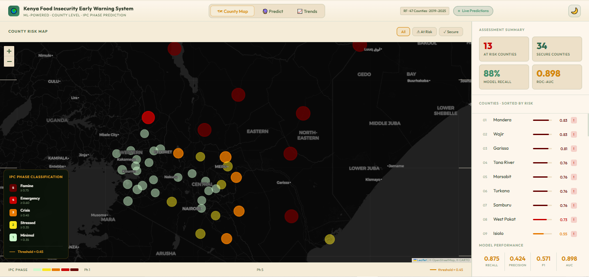
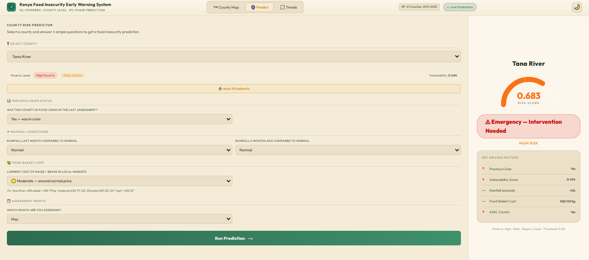
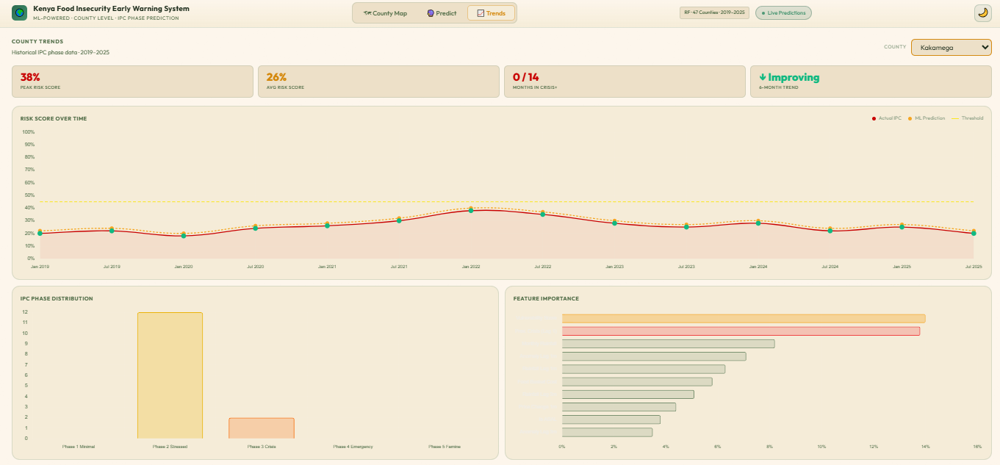
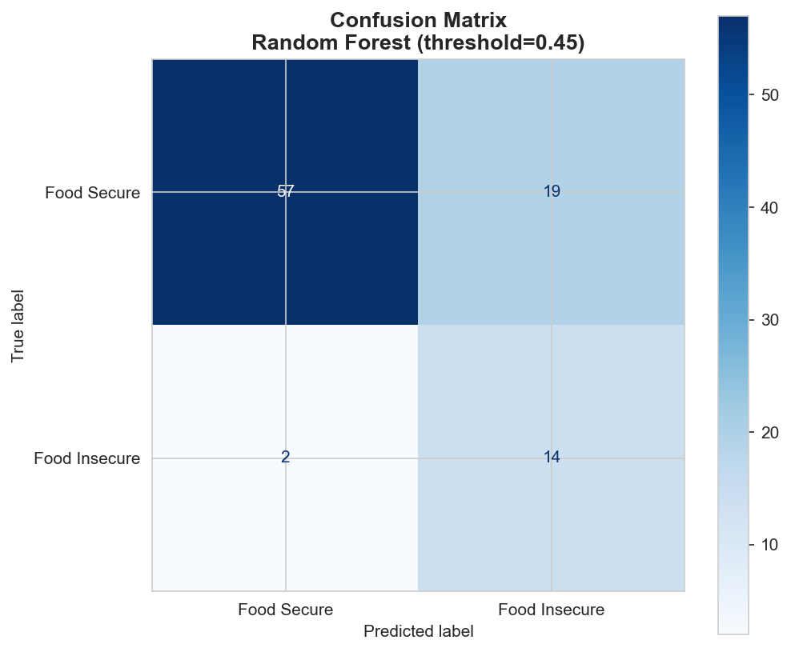
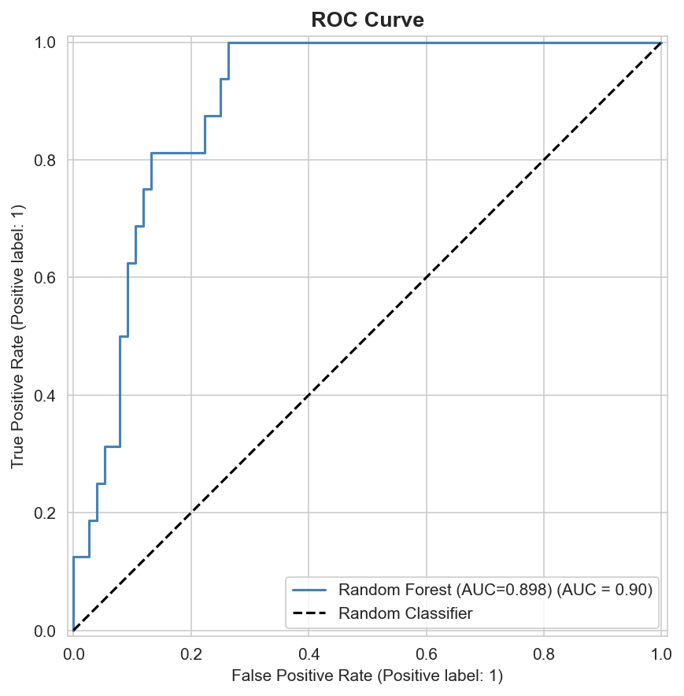
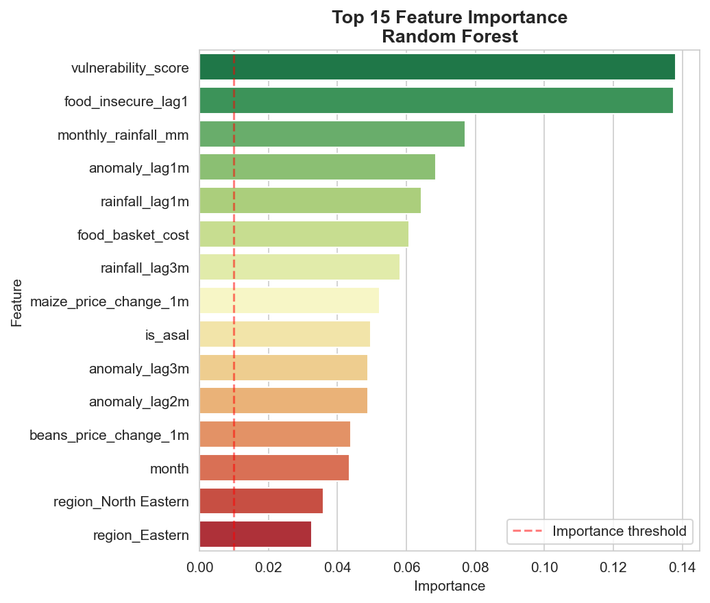
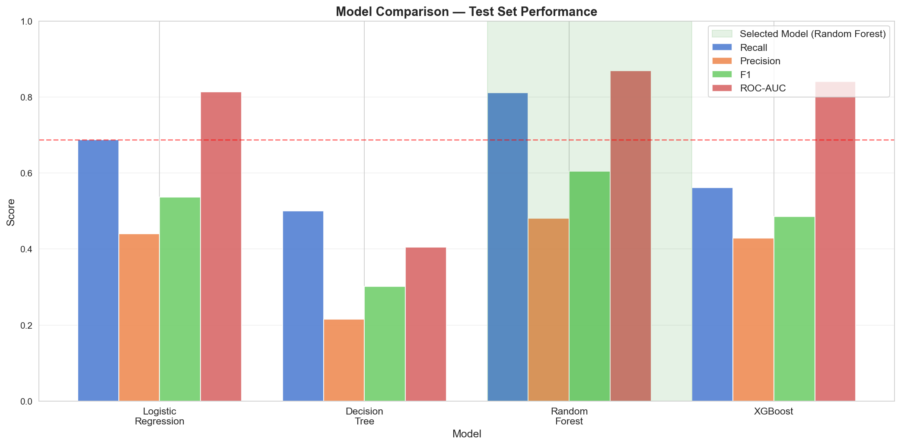
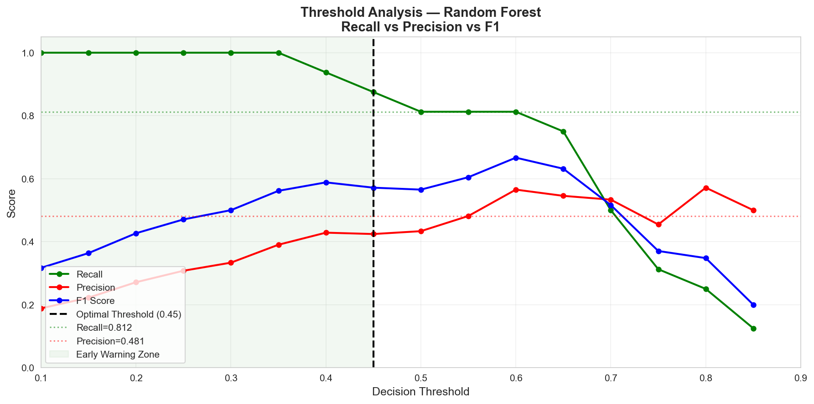

# 🇰🇪 Kenya Food Insecurity Early Warning System

> **ML-Powered · County Level · IPC Phase Prediction**  
> Random Forest Classifier · 47 Counties · 2019–2025

[](https://huggingface.co/spaces/Moringa-grp5/kenya-food-insecurity)
[]()
[]()
[]()
[]()

---

## 📌 Project Overview

Food insecurity in Kenya affects millions of people every year — yet most humanitarian responses are **reactive**, arriving after a crisis has already been declared. This project builds a machine learning early warning system that predicts county-level food insecurity **1 to 3 months in advance**, giving NGOs, county governments and humanitarian organizations time to act before people suffer.

The system is trained on real IPC food security assessments, WFP market price data, CHIRPS satellite rainfall records and DHS poverty indicators covering **31 Kenyan counties from 2019 to 2025**.

---

## 🌍 Live Application

🔗 **[huggingface.co/spaces/Moringa-grp5/kenya-food-insecurity](https://huggingface.co/spaces/Moringa-grp5/kenya-food-insecurity)**

The app has three pages:

| Page | What it does |
|------|-------------|
| 🗺 **County Map** | Shows all 47 counties color-coded by food insecurity risk |
| 🔮 **Predict** | Enter current field conditions → get instant IPC phase prediction |
| 📈 **Trends** | Historical food insecurity journey per county from 2019–2025 |

> 📷 **Screenshot — County Risk Map**  
> 
> 
> 

> 📷 **Screenshot — Predict Tab**  
> 
> 
> 

> 📷 **Screenshot — Trends Tab**  
> 
> 
> 

---

## 📊 Model Performance

| Metric | Value | What it means |
|--------|-------|---------------|
| **Recall** | 87.5% | Catches 87.5% of all real food crises |
| **ROC-AUC** | 0.898 | 90% better than random guessing |
| **Precision** | 42.4% | Of flagged counties, 42% confirmed crisis |
| **F1 Score** | 0.571 | Balance of precision and recall |
| **Threshold** | 0.45 | Lowered from 0.50 to maximize recall |

> **Why recall matters:** In humanitarian work, missing a real crisis is far more costly than a false alarm. We optimized for recall — the model would rather flag a county incorrectly than miss a genuine food emergency.

> 📷 ** Confusion Matrix**  

> 


> 📷 ** ROC Curve**  

> 


---

## 🗂 Datasets Used

| Dataset | Source | Records | Coverage |
|---------|--------|---------|----------|
| **IPC Food Security** | IPC Global Platform | 4,522 rows | 2019–2025 |
| **Rainfall (CHIRPS)** | UCSB Climate Hazards Center | 131,544 rows | 1981–2025 |
| **Food Prices** | WFP VAM / HDX | 17,365 rows | 2006–2025 |
| **Poverty (MPI)** | Kenya DHS 2022 | 47 counties | Static |
| **Conflict** | ACLED | 350 rows | 1997–2026 |

> ⚠️ Conflict data was excluded from modeling — near-zero correlation (0.096) with food insecurity confirmed it adds no predictive value for county-level prediction.

---

## ⚙️ Feature Engineering

28 features were engineered across 4 categories:

### 🌧 Rainfall Features (8)
| Feature | Description |
|---------|-------------|
| `monthly_rainfall_mm` | Actual rainfall in assessment month |
| `anomaly_lag1m` | Rainfall deviation from normal — 1 month ago |
| `anomaly_lag2m` | Rainfall deviation from normal — 2 months ago |
| `anomaly_lag3m` | Rainfall deviation from normal — 3 months ago |
| `rainfall_lag1m` | Absolute rainfall 1 month ago |
| `rainfall_lag3m` | Absolute rainfall 3 months ago |
| `is_drought` | Binary flag: anomaly below -50% |
| `is_flood` | Binary flag: anomaly above +200% |

### 🍽 Food Price Features (5)
| Feature | Description |
|---------|-------------|
| `food_basket_cost` | Combined maize + beans price (KES/kg) |
| `maize_price_change_1m` | Month-over-month maize price change |
| `beans_price_change_1m` | Month-over-month beans price change |
| `maize_price_stress` | Binary flag: price 20% above 3-month average |
| `has_price_data` | Data availability flag |

### 📅 Temporal Features (6)
| Feature | Description |
|---------|-------------|
| `month` | Assessment month (1–12) |
| `quarter` | Quarter of the year |
| `is_lean_season` | Flag for Jan, Feb, Jul, Aug |
| `in_long_rains` | March–May season flag |
| `in_short_rains` | October–December season flag |
| `season` | Encoded: dry=0, long rains=1, short rains=2 |

### 🏘 Structural Features (9)
| Feature | Description |
|---------|-------------|
| `food_insecure_lag1` | Was county in crisis last assessment? |
| `vulnerability_score` | MPI × 0.6 + severe poverty × 0.4 |
| `is_asal` | Arid and Semi-Arid Land county flag |
| `region_*` | 6 one-hot encoded region dummies |

> 📷 **Add graph here: Feature Importance**  

> 


---

## 🤖 Modeling Pipeline

```
Raw Data (5 datasets)
       ↓
Data Cleaning & Standardization
       ↓
Feature Engineering (28 features)
       ↓
Time-Based Train/Test Split (2019–2023 train | 2024–2025 test)
       ↓
SMOTE — Balance class imbalance (training only)
       ↓
StandardScaler — Normalize features (fit on train only)
       ↓
Model Comparison (Logistic Regression, Decision Tree, Random Forest, XGBoost)
       ↓
Hyperparameter Tuning (GridSearchCV)
       ↓
Threshold Optimization (0.50 → 0.45 for maximum recall)
       ↓
Feature Simplification (28 → 21 features, zero-importance removed)
       ↓
Final Model: Random Forest (Tuned, Simplified)
```

### Model Comparison

| Model | Recall | Precision | F1 | ROC-AUC |
|-------|--------|-----------|-----|---------|
| Logistic Regression | 0.688 | 0.440 | 0.537 | 0.814 |
| Decision Tree | 0.500 | 0.216 | 0.302 | 0.405 |
| Random Forest | 0.812 | 0.464 | 0.590 | 0.869 |
| XGBoost (Tuned) | 0.812 | 0.433 | 0.564 | 0.872 |
| **RF Tuned Simplified** | **0.875** | **0.424** | **0.571** | **0.898** |

> 📷 **Model Comparison Chart**  
>
 
> 
> 

> 📷 **Threshold Analysis**  
 
> 
> 

---

## 🧠 SHAP Interpretability

SHAP (SHapley Additive exPlanations) was used to explain individual model predictions.

**Top 3 drivers of food insecurity prediction:**

1. **`food_insecure_lag1`** — Past crisis is the strongest signal. Counties rarely recover within one assessment period — crisis persists.
2. **`vulnerability_score`** — Structural poverty creates a chronic baseline of risk that amplifies every climate or price shock.
3. **`anomaly_lag1m`** — Rainfall deficit from last month is the strongest climate predictor — not current rainfall, but what happened recently.

> 📷 **SHAP Summary Plot**  
> 
> 
>

> 📷 **SHAP Waterfall — Most Insecure Prediction**  
> 
> 
> 

---

## 🚨 IPC Phase Classification

| Probability | IPC Phase | Classification | Action |
|------------|-----------|---------------|--------|
| ≥ 0.75 | Phase 5 | 🔴 Famine Risk | Emergency response immediately |
| 0.60–0.75 | Phase 4 | 🔴 Emergency | Pre-position food stocks |
| 0.45–0.60 | Phase 3 | 🟠 Crisis | Activate county drought committees |
| 0.35–0.45 | Phase 2 | 🟡 Stressed | Monitor weekly |
| < 0.35 | Phase 1 | 🟢 Minimal | Routine monitoring |

---

## 🏗 Project Structure

```
Kenya/
├── data/
│   ├── raw/                    ← Original datasets (excluded from GitHub)
│   └── processed/              ← Cleaned and merged datasets
├── models/
│   ├── rf_food_insecurity_model.pkl   ← Trained Random Forest
│   ├── scaler.pkl                     ← StandardScaler
│   ├── top_features.json              ← 21 selected features
│   └── model_metadata.json            ← Threshold, metrics
├── notebooks/
│   └── blex.ipynb              ← Full analysis notebook
├── static/
│   ├── css/style.css           ← App styling
│   └── js/                     ← map.js, predict.js, trends.js
├── templates/
│   └── index.html              ← Main HTML template
├── images/                     ← Charts and screenshots
├── main.py                     ← FastAPI backend
├── Dockerfile                  ← Hugging Face deployment
├── requirements.txt            ← Python dependencies
└── README.md
```

---

## 🚀 Run Locally

```bash
# 1. Clone the repository
git clone https://github.com/MrDenzy/PHASE-5-PROJECT---Forecasting-County-Level-Acute-Food-Insecurity-in-Kenya-Using-Climate-Shocks-Mark.git
cd Kenya

# 2. Install dependencies
pip install -r requirements.txt

# 3. Run the app
uvicorn main:app --reload

# 4. Open browser
# http://127.0.0.1:8000
```

---

## 📦 Dependencies

```
fastapi==0.129.0
uvicorn==0.41.0
jinja2==3.1.4
joblib==1.4.2
numpy==1.26.4
pandas==2.2.3
scikit-learn==1.5.2
```

---

## 💡 Business Recommendations

**Alert Protocol:**
- **≥ 60% probability** → Activate emergency response — pre-position food stocks, mobilize NGO partners
- **45–60% probability** → Crisis alert — convene county drought committee, begin contingency planning
- **35–45% probability** → Stress watch — increase monitoring frequency, prepare budgets

**Recommended Users:**
- National Drought Management Authority (NDMA)
- World Food Programme (WFP) Kenya
- County Government Disaster Management Units
- FEWS NET Kenya analysts

---

## ⚠️ Limitations

- Price data covers only 26 of 47 counties — remaining 21 use regional averages
- IPC assessments are biannual — model cannot predict at monthly resolution
- Map shows structural baseline risk, not live updated risk
- Model trained on 31 counties — predictions for remaining 16 are indicative only

---

## 🔮 Future Work

- Connect to live CHIRPS rainfall API for automatic monthly updates
- Expand IPC training data to all 47 counties
- Add SMS alert system for county officials
- Build seasonal forecast integration (3-month outlook)

---

## 🙏 Acknowledgements

- **IPC Global Platform** — Food insecurity assessment data
- **UCSB Climate Hazards Center** — CHIRPS satellite rainfall data
- **World Food Programme** — VAM food price monitoring data
- **Kenya National Bureau of Statistics** — DHS poverty indicators
- **ACLED** — Conflict event data
- **Moringa School** — Project supervision and support

---

## 👥 Authors  

- [Blex Olonde](https://github.com/blexolonde)
- [Dennis Muriungi](https://github.com/MrDenzy)
- [Shem Omondi](https://github.com/OmondiOmolo)
- [Jasho Kiplangat](https://github.com/mcshoja)
- [Valary Kones](https://github.com/vkones)

**Moringa School — Phase 5 Capstone Project**  
Group 5 · Data Science · 2025/2026

---

## 📄 License

This project is licensed under the MIT License.

---

<p align="center">
  <b>Built to save lives through data science 🌍</b><br>
  <a href="https://huggingface.co/spaces/Moringa-grp5/kenya-food-insecurity">🚀 Try the Live App</a>
</p>
